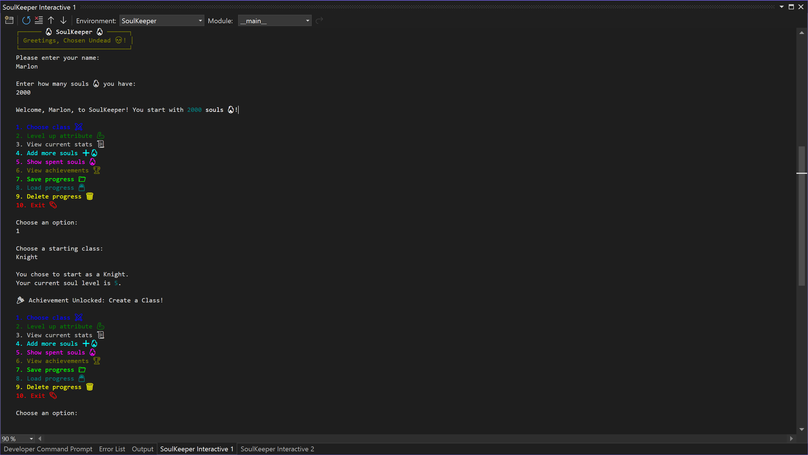

# **🔥 SoulKeeper 🔥**  

Welcome, Chosen Undead! 🗡️ This project is a **Dark Souls-inspired personal finance tracker** that helps you manage your "souls" (currency) by budgeting them across various attributes—just like in the game! Track how much you have, level up strategically, and unlock achievements while surviving the dangers of financial planning.  

## **⚔️ Project Overview**  

**SoulKeeper** keeps track of the number of souls a player has and allows them to:  
- Allocate souls to level up various attributes.  
- Track spending and savings across different attributes.  
- Complete quests for additional rewards and challenges.
- Experience random events that reward or punish their spending habits.  
- Unlock achievements for hitting financial milestones.  
- Save and load progress, ensuring they never "go hollow!"  

## **📜 Features**  

### **1. Choose Your Class** 🏹  
- Select from iconic classes such as **Warrior, Knight, Sorcerer, and more**, each with unique starting attributes and perks.  
- Perks provide cost reductions when leveling up specific attributes, making strategic choices crucial.  

### **2. Level Up Your Attributes** 🛡️  
- Spend your hard-earned souls to enhance key attributes like:  
  - Vitality 🩸 (Health)  
  - Strength 💪 (Power)  
  - Dexterity 🏃 (Agility)  
  - Intelligence 🧠 (Magic)  
  - Faith 🙏 (Miracles)  
- Dynamic **scaling costs** ensure increasing investment with higher levels.  

### **3. Budget Your Souls Wisely** 💰  
- Track the total number of souls you've spent.  
- View how much you've invested in each attribute via a **detailed spending report.**  
- Add more souls when needed, but beware of overspending!  

### **4. Random Events System** 🎲  
- Just like in the world of Dark Souls, unexpected events can occur:  
  - **Bonus Souls:** Find extra souls along your journey! ✨  
  - **Soul Thieves:** Beware, as you might lose precious souls to enemies lurking in the shadows. 👻  

### **5. Achievements System** 🏆  
- Unlock achievements for major milestones, such as:  
  - Reaching Level 10.  
  - Spending 10,000 souls.  
  - Selecting your first class.  
- Track progress with an interactive achievements table.  

### **6. Quest System** 📜  
- Take on quests that provide additional challenges and rewards.  
- Quests can have various requirements, such as spending a certain amount of souls or leveling up specific attributes.  
- Completing quests grants rewards like extra souls, attribute boosts, and special items.  
- Track your quest progress with a detailed quest table.

### **7. Save, Load, and Delete Progress** 📂  
- Never lose your progress! You can:  
  - **Save** your current souls and stats to a JSON file.  
  - **Load** past progress to continue your journey.  
  - **Delete** progress to start anew.  

### **8. Immersive User Interface** 🎨  
- Powered by the **`rich`** library, the terminal experience includes:  
  - Colorful outputs.  
  - ASCII-inspired tables for stats, spending, and achievements.  
  - Thematic Dark Souls elements with emojis and styling.  

## **🛠️ Installation**  

### **Prerequisites:**  
Ensure you have the following installed:  
- **Python 3.10 or later**  
- Required dependencies:  
  ```bash
  pip install rich
  ```

### **Running the Project:**  
1. Clone this repository:  
   ```bash
   git clone https://github.com/mvinza34/SoulKeeper.git
   cd SoulKeeper
   ```  
2. Run the main script:  
   ```bash
   python main.py
   ```  
3. Follow the on-screen prompts to begin your journey!  

## **🎮 How to Play**  

1. **Start by entering your name and initial number of souls.**  
2. **Choose a class** to determine your starting attributes.  
3. **Navigate the main menu:**  
   - `[1]` Choose a class.  
   - `[2]` Level up an attribute.  
   - `[3]` View your current stats.  
   - `[4]` Add more souls.  
   - `[5]` View total souls spent.  
   - `[6]` View quests.
   - `[7]` Check your achievements.  
   - `[8]` Save progress.  
   - `[9]` Load progress.  
   - `[10]` Delete progress.  
   - `[11]` Exit.  

4. **Level up wisely, unlock achievements, and survive!**  

## **📸 Screenshots**  

  
_Example image showcasing the immersive CLI experience_  

## **🚀 Future Enhancements**  

No major enhancements planned at this time. Suggestions welcome!

## **❓ FAQ**  

**Q: Is this a serious budgeting tool?**  
A: Yes and no! While it's designed to be fun and engaging, it introduces fundamental budgeting concepts in a gamified way.  

**Q: Can I customize classes or attributes?**  
A: Yes! You can easily modify the `Settings.py` file to add custom stats or perks.  

**Q: What happens if I run out of souls?**  
A: Don't worry! You can always add more souls, but beware—spending too much can have consequences!  

## **🧙‍♂️ Inspiration**  

This project was inspired by the **Dark Souls series**, blending elements of the game with real-world financial management concepts to create a unique budgeting experience.  

## **🤝 Contributing**  

Contributions are welcome! If you have suggestions or find bugs, please:  
1. Fork the repo.  
2. Make changes and submit a pull request.  
3. Follow the Dark Souls motto: "Git Gud."  

## **📜 License**  
This project is licensed under the MIT License.  


Enjoy your journey, Chosen Undead! Don't you dare go hollow! 🗡️💀🔥  